# Project Behavioral Cloning

## 环境搭建
本项目中Udacity利用unity平台设计了一个车辆行驶模拟器，通过在车辆上配置三个摄像头来捕获人工驾驶过程中车辆前方的图像信息，再经过神经网络的训练并形成网络模型后，让车辆自动根据每个采样周期采集到的图像信息计算转向角度，最终实现自动驾驶。  

在实战中，由于workspace中的unity模拟器太卡，完全无法对车辆进行控制，而且由于国内运营商防火墙的控制，也无法下载到本项目的样例数据，所以此项目我采用在自己电脑上搭建所有环境的方式。  

首先是安装unity的软件安装，在windows平台下按照下载的unity软件的安装向导完成。然后从udacity的github上下载self-driving-car-sim代码库：  
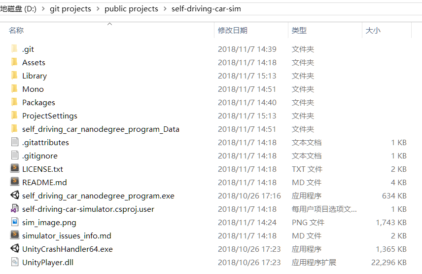     
然后在unity软件中，选中car-sim的目录进行场景构建，最终生成一个exe文件，该文件可以启动udacity自动驾驶模拟器。
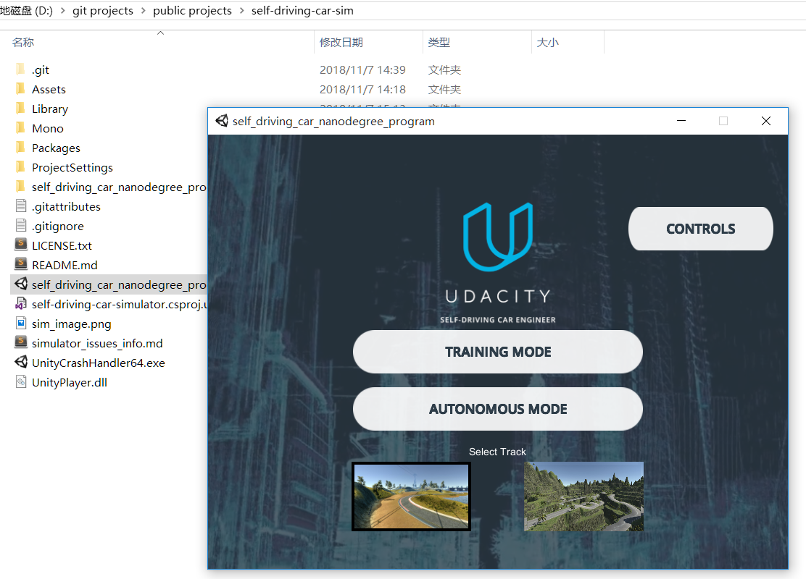     

## 数据采集 
下一步是采集训练数据，先用手动模式跑两三圈，生成的图片放在项目外的一个文件夹中。    
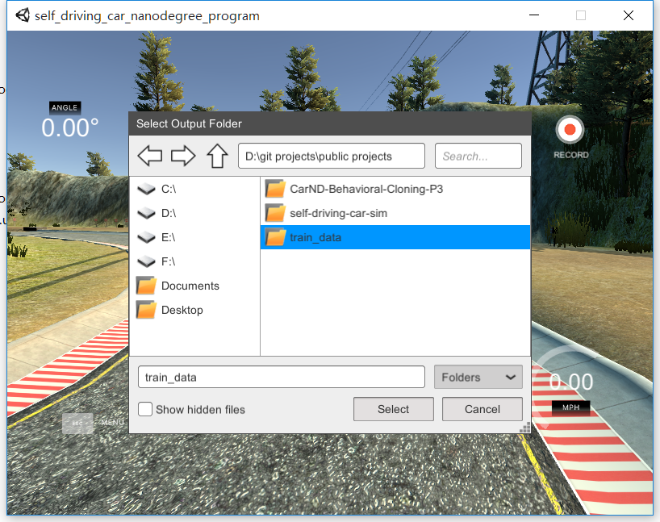   
后来发现数据量太少导致模型效果不好，又增加了好多训练数据的文件夹。     
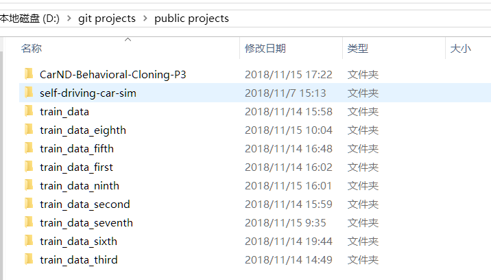   
初次采集数据，一共跑了四圈，全部是键盘操作。两圈是将车辆保持在跑道中间位置，还有两圈则是将车左右来回摆动。
下图是车辆行驶在跑道中间：
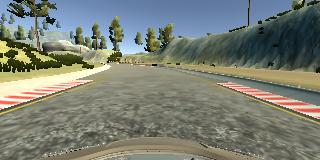  
下图是车辆行驶到跑道右侧边缘：
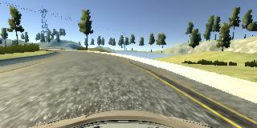  
下图是车辆从跑道边缘回到跑道中心：
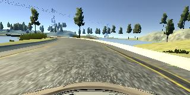  
  
之后发现在上桥之后一直碰撞边缘，所以又采集了一组在桥上往返的图像：
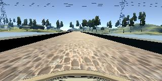 
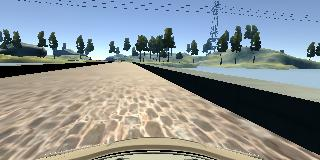 
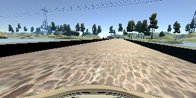 
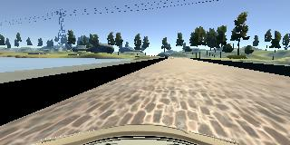 
充足的数据量是魔性训练的基础，在采集多组数据后，额外添加左右摄像头的数据进入数据集，再将所有图片进行水平翻转增加一倍数据量，最终的数据集总数达到50000多。

## 代码实现
### 我略微修改了文件读取的几行代码，由于我采集了多次驾驶数据，分别用不同的文件夹存储，所以我的程序里需要从多个目录中读取csv和image。
### 从上述采集数据的图片中可以看出图片上方的天空和树木对行车路径的判断没有帮助，还有最底下车头的那部分面积也没有帮助，所以在训练模型前将该区域进行剪裁。
### 程序中将左右照相机中的图像也作为基础数据进行处理，增加了模型训练的数据量。
### 按照教程中的建议，将Lenet网络架构更改为nvidia的网络架构，使得参数数量控制在比较少的级别，大约是4M大小的文件。
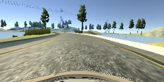  

### 在前几层卷积之间加上dropout层以防止过拟合，但是根据多次训练的经验，该网络架构仅需一至两次训练即收敛至稳定水平，说明这个模型的性能非常好。
### 在全连接层的调试中，根据评审员的指导，增加了relu激活函数。
### 感谢评审员给我的指导，指出了使用cv2.imread函数以BGR的方式打开图像存在问题，我在代码中改用pillow.image.open的函数打开图像。

## 小结
这是一个非常有意思的项目，尽管在项目过程中碰到了许多问题。    
### 由于之前在我的电脑中已经存在多个版本的python，甚至还有一些tensorflow相关的模块，导致了我在初次部署本地仿真环境时经常遇到python进程异常退出的问题，后来一共经过两次彻底的重装才完成了一个干净的仿真环境。    
### 在最初我计划是在本地电脑训练模型，再将训练后的模型上传至workspace，最后在workspace跑自动驾驶的场景，期间也遇到了两个非常棘手的问题，如：提示keras的版本问题，训练时的版本和仿真时的版本不一致，涉及到keras版本降级，所以又是一次重装环境。
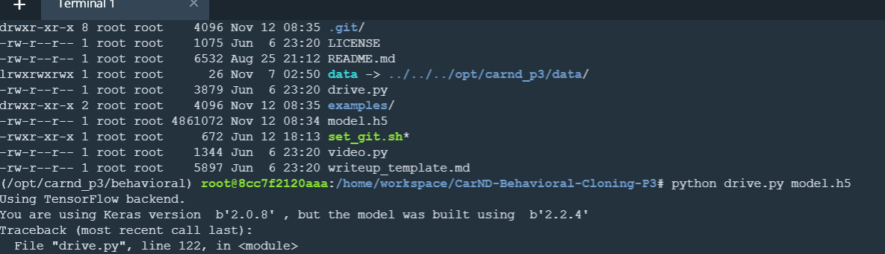     
之后再次仿真时一直报Segmentation fault (core dumped)   的错误，最终放弃在workspace上进行仿真，所以全部的项目工作全部转至本地电脑运行。     
### 由于本人的电脑是ATI的显卡，tensorflow使用ATI的显卡非常困难，在网上查找了一圈后决定使用CPU跑魔性训练，所以每次魔性训练都要花费大量的时间，下图是约1300张图片在使用近似Lenet模型训练时花费的时间。   
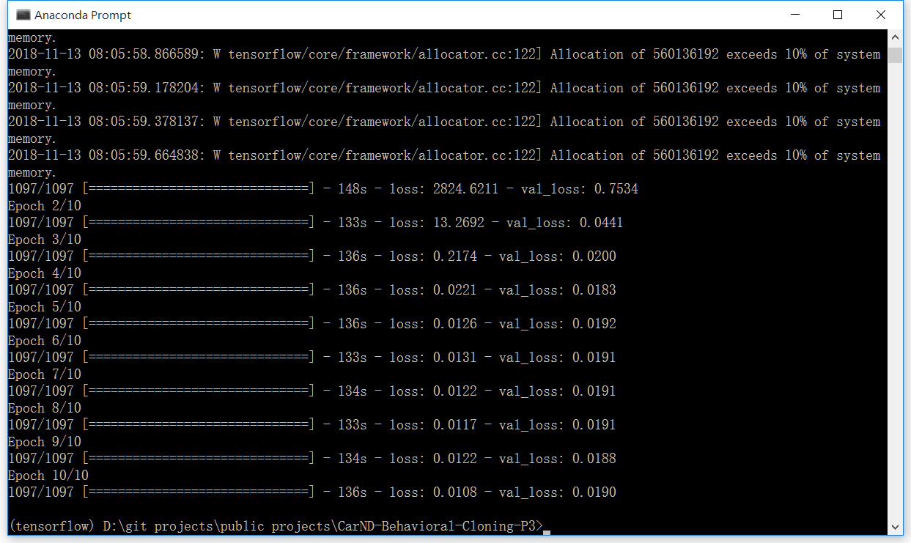
### 最终小车能够完整的跑上一圈，最终模型在训练时使用的图像总数量为53802，验证集占20%，验证集最终误差约0.3892。
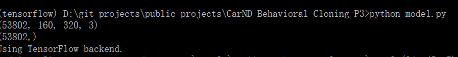
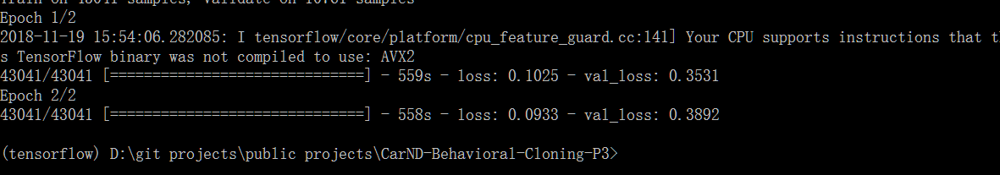
