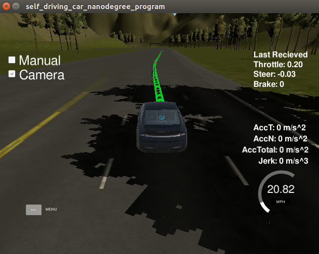
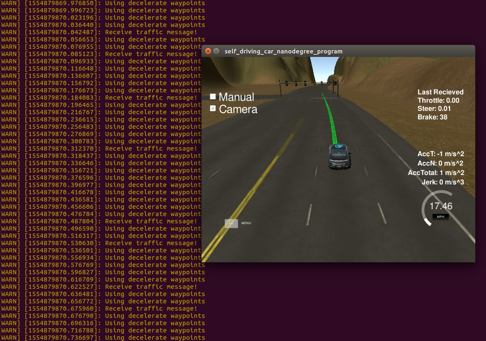
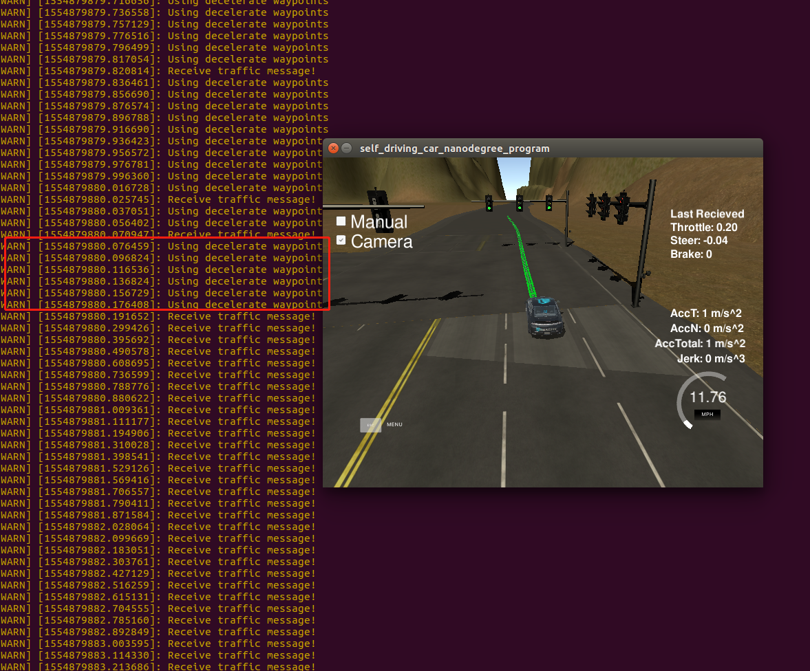

# CarND-Capstone

## 项目概述
本项目是一个无人驾驶系统的集成项目，包含了众多之前课程中所学的内容。项目已经提供了完整的ROS框架，拆分了不同的功能模块来执行不同的任务。各个功能模块之间通过ROS的消息进行通信，项目的一个考察点即是部分msg的发布和订阅。

项目中包含了以下模块：
tl_detector是交通灯的检测，它实时输出各个位置交通灯的显示结果。
twist_controller是线控模块，用来控制车辆行驶。
waypoint_follower通过输入的waypoint信息，转换成线控指令给线控模块执行。
waypoint_loader是从文件读取所有路点的信息，由于是在虚拟环境中测试，所以路点信息已经以文件形式存储。按照我的理解这个模块只在节点启动时执行一次后保存在内存中，之后以base_waypoints的结构将信息发送给其他ros节点。
waypoint_updater用于更新路点，根据当前位置以及全局的路点信息，来更新下一段时间车辆的规划路径。该模块还包含交通灯的响应模块，在面对红灯时需要规划路线和速度使车辆停在红灯前。


## 项目实现
### waypoint_updater
在waypoint_updater节点中，我去网上学习了一下视频中提到的KDTree的原理和用法，受益匪浅，实现了快速获取离自己最近的路点。
该模块的核心共两行代码：
```
closest_waypoint_idx = self.get_closest_waypoint_idx()
self.publish_waypoints(closest_waypoint_idx)
```
第一行是从base_waypoints中获取到紧挨着自己的路点
第二行就是用距离自己最近的路点来生成规划路径
在get_closest_waypoint_idx函数的实现中利用了向量的点积(np.dot)的正负来判断最近的路点是在前面或是后面。
难点在于对红灯情况下的路径变化，在实现中需要利用当前位置与红灯位置之间的距离来控制速度的连续变化。

### twist_controller
该控制器主要使用了三种控制方法：
1、yaw角度控制器负责控制方向盘的转角
2、PID控制器负责油门的控制
3、低通滤波器用来平滑车速，车速最终用来控制刹车的力矩
在实现中需要注意dbw_enabled标志位，在手工测试模式下必须要将PID控制器重置，否则积分环节的误差会持续积累。


### dbw_node
线控模块调用twist控制器，根据一系列的车辆静态参数，来输出油门，刹车和转向结果。


### tl_detector
交通灯检测模块需要在遇到前方红灯时发布消息，由于依赖base_waypoint信息，所以这里再次使用KDRree来存储base_waypoints。由于订阅的消息中已经有light.state的信息了，所以这里就没有专门写红绿灯检测的节点（这个写一下应该会花费不少的时间）。
当检测到路径上存在红灯时，将红灯停止线位置的路点索引发布给waypoint_updater来修改路径规划。


## 项目小结
### 首先对于从未接触过ROS的我而言，无人驾驶工程师的最后一个项目确实有着相当高的难度。即使在有解说视频帮助的情况下，我依然花了几天时间来调试和处理bug。
### 其次，本项目是一个综合全面的无人驾驶系统集成项目，除了在项目中实践最新学习的ros开发之外，还集成了前几节课所学的机器视觉、PID控制、路径规划等课程的知识。
### 由于时间有限，所以本项目我并未编写红绿灯检测的节点，直接用了系统提供的红绿灯状态来做判断。其实这应该是一个很有意思的模块，待学期结束后将尝试用神经网络来检测交通灯。
### 本项目的另一个难点是搭建测试环境，由于多种原因我先后两次重建了虚拟机，才跑通了这个项目：

车辆能够保持在车道内行驶，没有明显的急加速和急减速

我在调试的时候也验证了车辆在发现前方红灯时采取了减速措施，见图片002


当红绿灯恢复成绿灯后，便不再减速，可以在下图中的输出消息中看到下面一半的消息中没有"Using decelerate waypoints"的内容。



