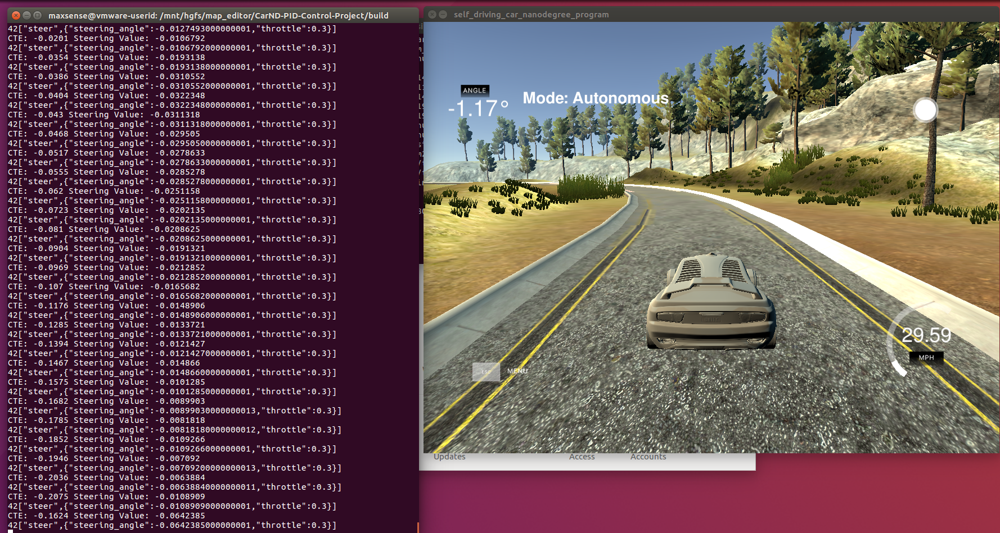

# CarND-Controls-PID

## 概述
本项目要求设计一个PID控制器，根据输入的CTE（即车辆中心与道路中心的横向偏移）来运算输出车辆方向盘的角度，使车辆尽可能快的在道路上行驶。

## 代码实现
1、kp,kd,ki三个参数手工指定，cte由仿真器给出，p_error,d_error,i_error分别为cte，cte微分，cte积分后的误差。
2、转向角直接用PID函数的输出值，通过多次测试选择合适的PID参数。
3、在计算转向角的时候要注意输出范围为[-1,1]：
```
if(steer_value > 1)
            steer_value = 1;
          if(steer_value < -1)
            steer_value = -1;
```


## 小结
1、本项目使用的仿真环境是上学期behievior clone中使用的仿真环境，记得当时使用神经网络根据摄像头的输入决定输出角度。神经网络的输出不稳定，所以当时全程以10MHP的速度行驶，而PID生成的结果是可以预期的，可控的，所以车辆能够始终以最高速度行驶。
2、尝试了多套参数后，最终使用:
```
  double kp = 0.1;
  double kd = 1;
  double ki = 0.001;
```
这三组值得到了一个运行尚可的控制器，车辆能够始终保持在道路内行驶，又不会像新手一样频繁来回打方向。
3、课程中最后一节讲述的twiddle方法用于优化PID参数，但是在本项目内我似乎没找到合适的方法嵌入这个算法，所以参数都是手工调的。



