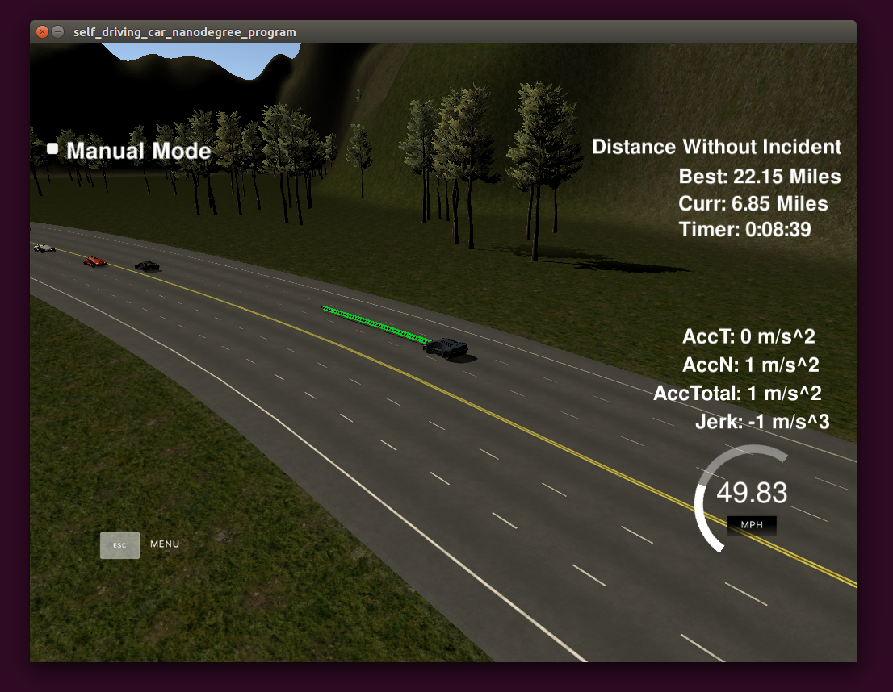

# CarND-Path-Planning-Project
   
## 概述
本项目需要设计一个路径规划器，用于引导车辆在高速公路上尽可能长时间的行驶。由于workspace不便于调试，故拷贝整个环境和模拟器到本地的ubuntu操作系统下进行开发和测试。

## 设计思路
1、在模拟器中实现车辆移动的原理是在指定的变量(next_x_vals)中赋予车辆前方50个路点的坐标，然后车辆按照模拟器的设计以0.02s的周期沿着路点移动，故本程序最终的输出结果为固定长度的路点坐标。
2、如果车辆需要沿着车道前进，可使用Frenet坐标大量简化数学运算，但是由于道路并非是连续的曲线，故在路点取值时需要采用spline函数进行曲线平滑插值。
3、当作为基本函数的加减速，变道等函数设计完成后，主要工作量就是收集传感器融合数据监测前方路径上的车辆并进行避让。

## 代码实现
### 关于spline函数的使用，Frenet与XY的坐标变换，以及基于当前速度的路点的生成已经在课程视频中讲解的非常清楚。
### 读取sensor_fusion数据并执行加减速及变道的代码设计如下：
1、设计了一个有4个状态限状态机，使用c++的switch实现，状态共分为加速、减速、左转、右转。其中加速度为固定数值，减速度做了优化，将前车与自身的速度差值作为计算因子，可以实现较为稳定的跟车状态，为找到空档变道提供较高的初始速度。

2、程序中使用了几个flag来表达无人车可以进入的状态：
```
bool close_car_before = false;
bool exist_car_left = false;
bool exist_car_right = false;
```
在一次sensor_fusion循环后，即可确认4种状态的可行性，然后按照后面代码的规则选择最优方案。

3、在择优程序中，我设计了一组简易的if分支来替代代价函数，优先级按从前至后递减：
```
if(close_car_before == false)
  result = 'w';
else if(exist_car_left == false && exist_car_right == false)
{
  if(car_left_sum <= car_right_sum)
    result = 'a';
  else
    result = 'd';
}
else if(exist_car_left == false)
  result = 'a';
else if(exist_car_right == false)
  result = 'd';
else if(close_car_before == true)
  result = 's';
```
首先前方无车阻挡是优先级最高的，意味着无需做任何检测直接已最高限速行驶。如有车阻挡则优先考虑变道，这里向左和向右变道的优先级是等同的。最后则选择减速跟随前车。
这里对左右均可变道的场景做了优化，无人车会比较sensor_fusion中左右两边车道的车辆数来选择较少车的车道实施变道，这样可以避免将车变到更慢的车道上。


## 结果
最好的一次测试结果为22.15Miles，时间约30分钟。

这是很有意思的一个项目，尤其是在模拟时观察无人车执行的各种操作，然后不断调整自己的代码，调节参数，让它按照自己的想法在路面上行驶。
